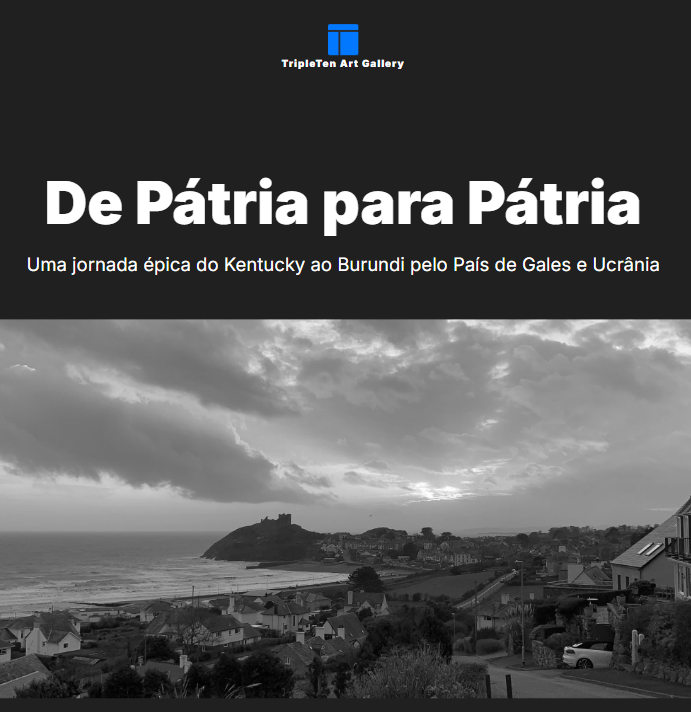
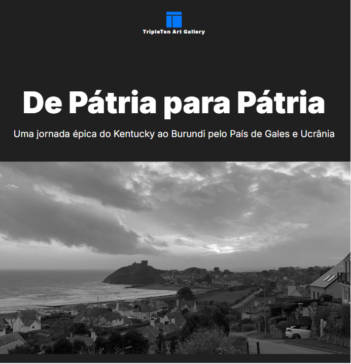
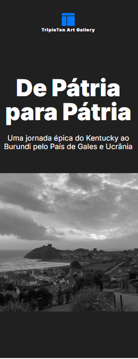

# Projeto 5: TripleTen Art Gallery - Layout Responsivo

**▶️ Visualizar Projeto Online**(https://douglasargenta.github.io/web_project_homeland/)

Este é o quinto projeto da Trilha de Desenvolvimento Web da TripleTen, focado na implementação de um layout responsivo para a "TripleTen Art Gallery".

## Visão Geral do Projeto

Este projeto implementa um layout responsivo para a 'TripleTen Art Gallery', garantindo uma experiência de usuário otimizada em desktop (1280px), tablet (768px) e mobile (320px). O desenvolvimento focou nas melhores práticas de CSS, como Flexbox e Media Queries, para replicar fielmente o design em todas as resoluções especificadas.

## Funcionalidades e Características

- **Layout Responsivo:** A página se adapta perfeitamente a três breakpoints principais (1280px, 768px e 320px).
- **Design Fiel:** Todos os elementos visuais, espaçamentos, tipografia e cores foram implementados de acordo com os designs fornecidos.
- **Metodologia BEM:** As classes CSS seguem a metodologia BEM (Bloco Elemento Modificador) para garantir um código organizado e escalável.
- **Flexbox:** Utilização extensiva do Flexbox para posicionamento e alinhamento de elementos, garantindo flexibilidade e robustez do layout.
- **Estrutura Semântica:** O HTML é estruturado semanticamente, utilizando as tags apropriadas para cada tipo de conteúdo.

## Tecnologias Utilizadas

- **HTML5:** Para a estrutura e conteúdo da página.
- **CSS3:** Para a estilização e responsividade, com ênfase em:
  - Flexbox
  - Media Queries
  - Unidades Relativas (px, em, %)
- **Normalize.css:** Utilizado para garantir a consistência de renderização entre diferentes navegadores.
- **Fonte Inter:** Utilizada para a tipografia do projeto, com arquivos hospedados localmente na pastavendor/fonts/e fontes do sistema como alternativa.

# Estrutura de Arquivos

O projeto segue a metodologia BEM Flat para a organização dos arquivos e pastas:

```
/
├── .gitignore
├── .editorconfig
├── index.html
├── README.md
├── assets/
│ └── images/
│ ├── desktop-view.png
│ ├── tablet-view.png
│ └── mobile-view.png
├── blocks/
│ ├── header.css
│ ├── cover.css
│ ├── intro.css
│ ├── base.css
│ └── footer.css
├── images/
│ └── (todas as imagens do projeto, ex: tripleten-logo.svg, cover-image.jpg)
├── pages/
│ └── index.css
└── vendor/
├── normalize.css
└── fonts/
└── (arquivos das fontes utilizadas, ex: Inter-Regular.woff)
```

### Visualização do Projeto

Para uma melhor compreensão dos recursos, aqui estão algumas capturas de tela do projeto em diferentes seções:

**Visualização em Desktop (1280px):**


**Visualização em Tablet (768px):**


**Visualização em Mobile (320px):**


---

## Planos de Melhoria

Para futuras iterações e aprimoramento do projeto, planejo explorar:

1.  **Animações Suaves:** Adicionar transições e animações CSS sutis para melhorar a experiência visual sem comprometer a performance.
2.  **Componentes Reutilizáveis:** Refatorar o código para identificar e criar componentes CSS mais reutilizáveis, facilitando a manutenção e futuras expansões.

```

```
